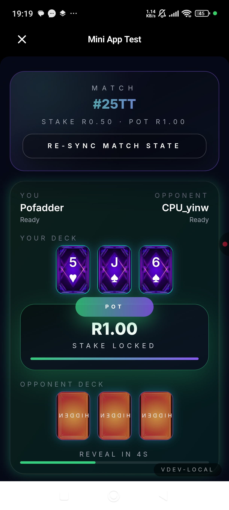
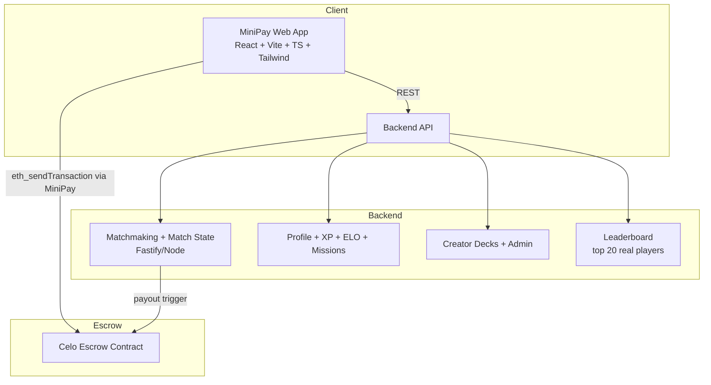
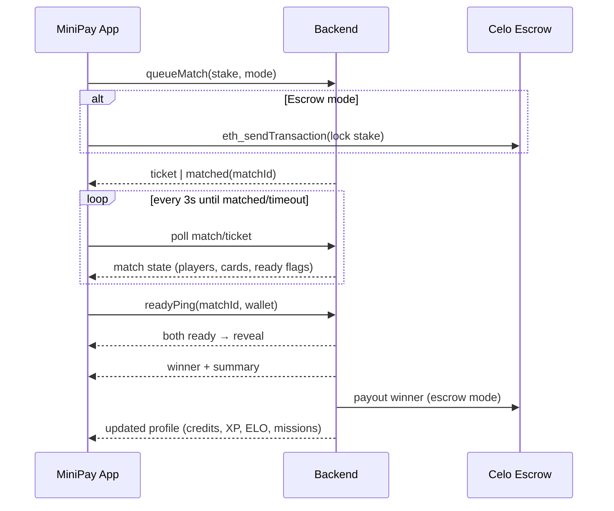

# PocketPoker

 

Mobile‑first MiniPay game where two players lock a tiny stake, get 3 cards each, and snap‑reveal the winner. Includes a creator portal for community decks and a lean backend that tracks profiles, XP, ELO, missions, and a real leaderboard (top 20).

## Youtube Video 

https://youtu.be/kgCalrq61EM
---

## Gameplay Snapshot
- **Mode:** 1v1 “Stake & Showdown” (3 cards, no betting rounds).
- **Flow:** Queue → Ready check → Reveal → Winner takes pot → XP/ELO/credits updated.
- **Currencies:** Demo credits (R50 seed) for testing; MiniPay stakes for real money when available.
- **Progression:** XP levels, ELO leaderboard, missions, and deck cosmetics.
- **Leaderboards:** Top 20 by ELO, then wins; real player stats.

---

## For This Hackathon 
- https://www.hackersdao.com/celo-minipay-hackathon
- URL: https://pocketpoker.co.za/
- Set MiniPay app into developer mode and under Developer Settings, goto "Test your Mini App" and enter the PocketPoker url.
- Admin backend to approve creator submissions: https://drive.google.com/file/d/1ZTXbfZpceJhdqDmzkFAsxnvdQjrbvY88/view?usp=sharing


## How to Play
1) Open the app inside **MiniPay** (required for gameplay).  
2) Lobby: pick a stake, toggle PvP or bot quickplay (demo only), tap **Play now**.  
3) Matchmaking: you’ll see the ready check; auto re-sync runs every 3s while waiting.  
4) Reveal: cards flip, winner highlighted.  
5) Results: credits/escrow settle, XP/ELO updated, missions progress; play again or return to lobby.

---

## Creator Portal
- **Submit decks:** `/creator-decks` lets creators upload preview art + wallet for payouts.
- **Review:** `/admin` (admin key) approves/rejects decks and flags NSFW.
- **Live soon:** Approved decks surface in Decks with “Live soon” badges; purchases record platform fee and creator share for later payout.

---

## Architecture (Mermaid)


---

## Matchmaking & Game Loop


---

## Repo Layout
```
frontend/   React + Vite + TypeScript + Tailwind (MiniPay UI)
backend/    Fastify/Node + TypeScript (matchmaking, profiles, missions, creator portal)
contracts/  Hardhat Celo escrow contract + tests/deploy scripts
assets/     Images, deck previews
docs/       Product brief, UI spec, style guide (source of truth)
```

---

## Running Locally (MiniPay required for gameplay)
1) Install deps  
   ```bash
   npm install
   cd frontend && npm install && cd ..
   cd backend && npm install && cd ..
   cd contracts && npm install && cd ..
   ```
2) Env samples  
   - `frontend/.env.local`
     ```
     VITE_BACKEND_URL=http://localhost:4000
     VITE_ESCROW_ADDRESS=0x8Adf65484A90Cb691B712484B24B6D52d2cF927c
     VITE_MINIPAY_CHAIN_ID=44787
     VITE_ENABLE_BOT_MATCHES=true
     VITE_ADMIN_KEY=demo-admin-key
     VITE_CELO_ZAR_RATE=100000
     ```
   - `backend/.env`
     ```
     PORT=4000
     ADMIN_API_KEY=demo-admin-key
     CELO_RPC_URL=https://forno.celo-sepolia.celo-testnet.org
     PLATFORM_FEE_PERCENT=2
     ```
3) Start backend  
   ```bash
   cd backend
   npm run dev
   ```
4) Start frontend  
   ```bash
   cd frontend
   npm run dev
   ```
5) Open the app **inside MiniPay** (real gameplay gated); /admin stays open in any browser for approvals.

---

## Leaderboard (Top 20)
- Built from real profiles (elo, wins) in the data store; sorted by elo then wins, limited to 20 entries.
- Dynamo store uses the same logic; if no profiles exist, a small sample is returned.

---

## Creator Portal & Admin
- `/creator-decks`: submit deck art + creator wallet; see status badges.
- `/admin`: approve/reject decks, set review notes, flag NSFW, view sales/platform fee rollups. Requires `ADMIN_API_KEY`/`VITE_ADMIN_KEY`.

---

## Testing & Build
- Frontend: `npm run build` (tsc + vite), `npm run test` (Vitest), `npm run test:e2e` (Playwright smoke).
- Backend: `npm run build` (tsc), `npm run test` (Vitest).
- Contracts: `npx hardhat test`, `npx hardhat compile`, deploy via `scripts/deploy.ts`.

---

## Deployment Notes
- Frontend: static host (S3/CloudFront, Vercel, Netlify). Ensure `VITE_BACKEND_URL` points to your API and MiniPay is the host environment.
- Backend: run as a long-lived service (App Runner, ECS/Fargate, EC2, Fly). Timers drive matchmaking; Lambda cold starts are not ideal unless adapted.
- Escrow: Celo contract at `0x8Adf65484A90Cb691B712484B24B6D52d2cF927c` (Sepolia). Set `VITE_ESCROW_ADDRESS` and backend payout config accordingly.

---

## Key Constraints
- Gameplay requires MiniPay (EIP-1193 provider with `isMiniPay`). Non-MiniPay sessions are redirected to the splash; admin remains accessible.
- Matchmaking uses polling (no WebSockets in MiniPay), with 3s auto re-sync while waiting in ready check.
- Demo mode uses credits; real stakes flow through MiniPay + escrow when available.

---

## Links
- Product brief: `docs/PROJECT_BRIEF.md`
- UI spec: `docs/UI_SPEC.md`
- Style guide: `docs/STYLE_GUIDE.md`
